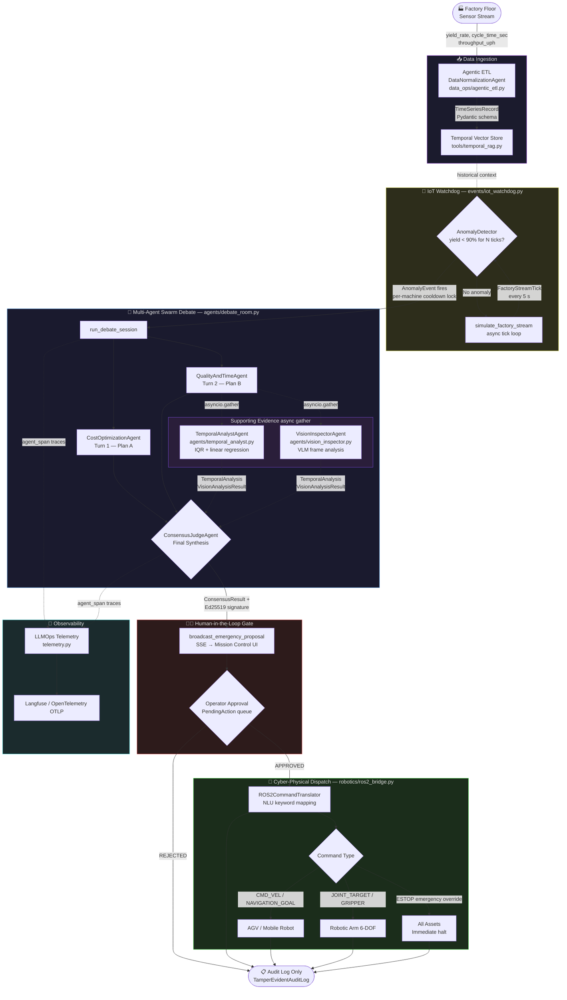
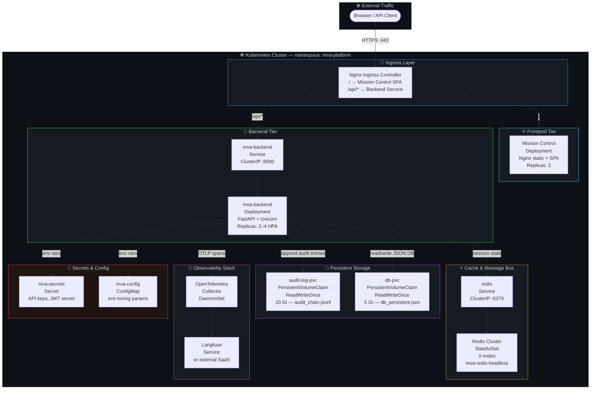
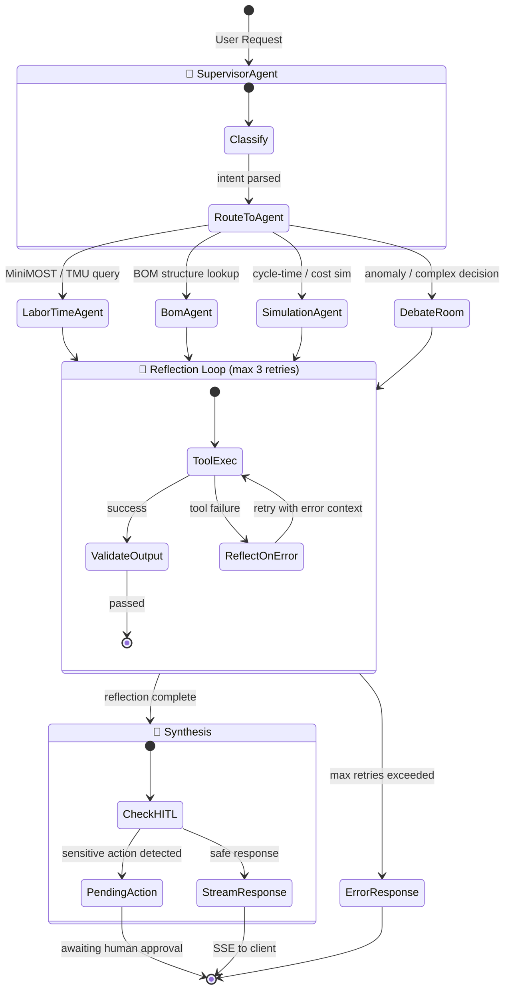
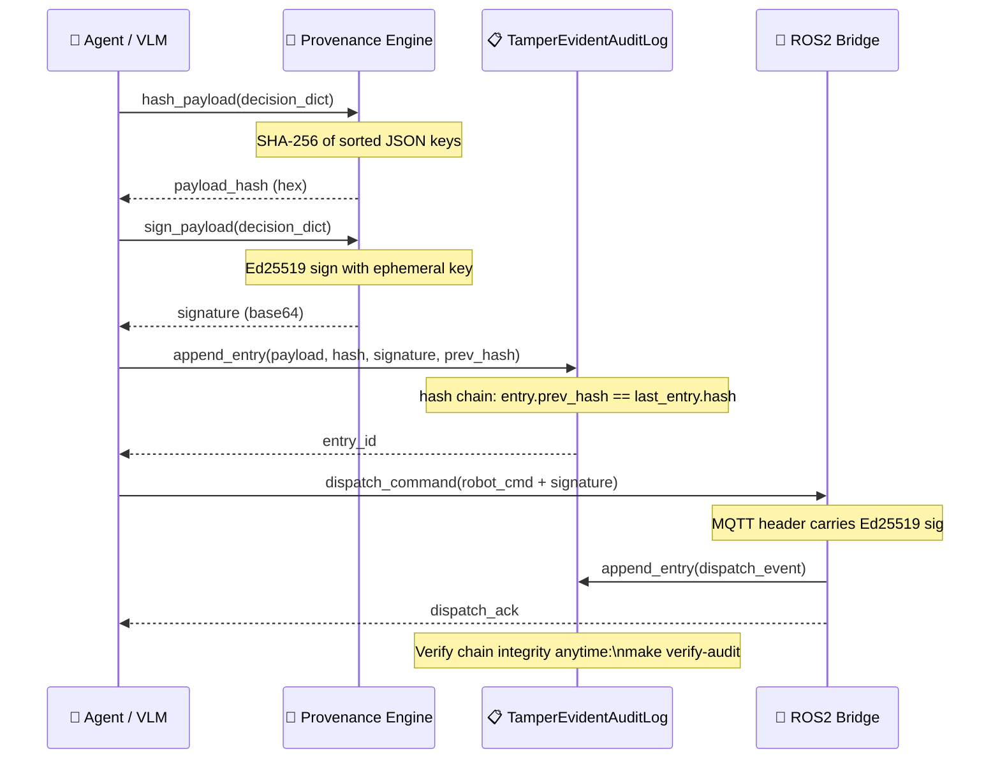

# Architecture Diagrams

This document contains Mermaid.js diagrams that describe the core architecture of the Enterprise MVA Platform. All diagrams render natively on GitHub.

---

## 1. End-to-End Data Flow

The following diagram traces an anomaly event from the factory floor through the full AI reasoning pipeline and back to physical robotic dispatch.

---

## 2. Kubernetes Infrastructure

The following diagram shows the production K8s topology in the `mva-platform` namespace, including ingress, service mesh, stateful storage, and the telemetry sidecar.

---

## 3. Agent Swarm Internal State Machine

The reflection loop and routing logic inside `agent_router_poc.py`.

---

## 4. Cryptographic Provenance Chain

How every AI decision and robot command is chained into the tamper-evident audit log.

