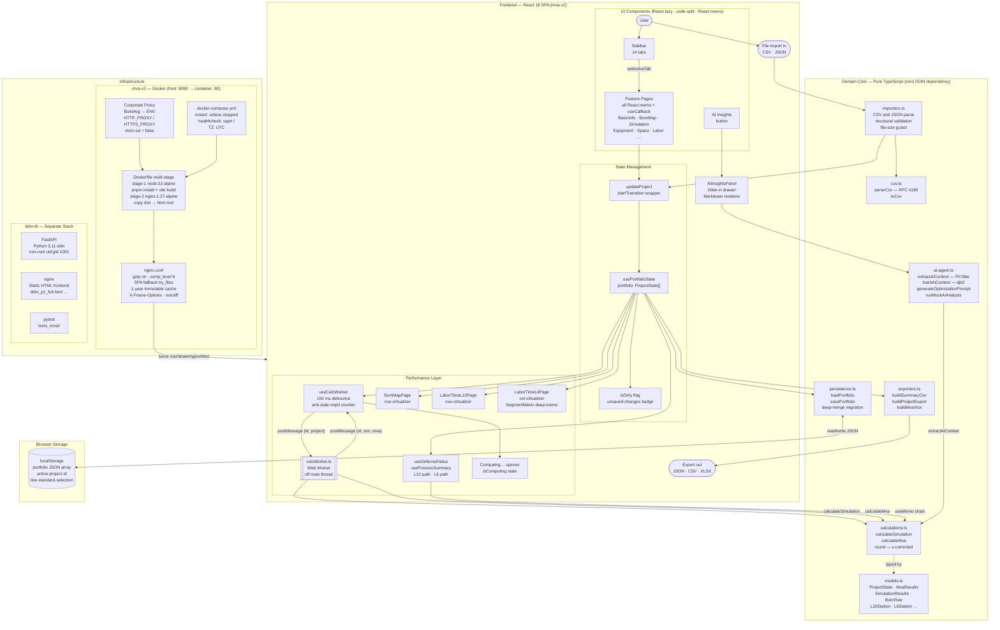

# MVA Platform — System Architecture

> **Phase 12 · Enterprise Handover document**  
> Last updated: 2026-03-27  
> Branch: `202603-feat-extreme-perf`

---

## High-Level Data Lifecycle

The diagram below traces a piece of data from the moment a user types a value
into the UI all the way into a Docker-served nginx response, including the
off-main-thread worker path, the virtualized rendering layer, the AI agent
pipeline, and the separate `ddm-l6` infrastructure stack.



---

## Subgraph Descriptions

### Frontend — React 18 SPA

| Concern | Implementation |
|---|---|
| Routing | Client-side tab state (`activeTab: TabId`), no React Router |
| Code splitting | `React.lazy` per feature page; only the active tab is ever parsed |
| Re-render isolation | All feature pages are `React.memo`; mutation handlers are `useCallback` with minimal dep arrays |
| State transitions | `updateProject()` is always wrapped in `startTransition()` so input events are never blocked by re-renders |
| Suspense fallback | `<Suspense>` wrapping the entire feature area; lazy pages show "Loading…" spinner on first visit |

### Domain Core

All business logic lives in plain TypeScript files with **zero DOM or React
imports**.  This makes them testable in Node.js (Vitest), runnable inside a Web
Worker, and safe to server-render if needed.

| File | Responsibility |
|---|---|
| `calculations.ts` | `calculateSimulation` (cycle-time bottleneck model), `calculateMva` (17-line cost rollup), all helper math |
| `models.ts` | Every domain type as TypeScript `interface` / `type`; single source of truth |
| `importers.ts` | All CSV and JSON parsers, structural validators, file-size guard (`assertFileSize`) |
| `exporters.ts` | `buildSummaryCsv`, `buildProjectExport` (JSON), `buildMvaXlsx` (multi-sheet) |
| `persistence.ts` | `loadPortfolio` / `savePortfolio` with deep-merge so new fields populate safely after schema changes |
| `csv.ts` | Hand-rolled RFC 4180–compliant CSV parser; no third-party dependency |
| `ai-agent.ts` | Context extraction → djb2 hash → prompt generation → mock LLM response; fully swappable to a real LLM |

### Performance Layer

| Mechanism | Benefit |
|---|---|
| Web Worker (`calcWorker.ts`) | `calculateSimulation + calculateMva` run off the main thread; UI stays at 60 FPS during heavy computation |
| 150 ms debounce in `useCalcWorker` | Rapid keystrokes are batched into a single worker call; intermediate values are never sent |
| Anti-stale `reqId` counter | Responses from superseded requests are silently discarded; no stale-result flash |
| `useDeferredValue` for L10/L6 summaries | These deferred paths accept one render-cycle lag; they never block the primary input flow |
| `@tanstack/react-virtual` | Row-virtualised BOM table (5 000+ rows) and L10 station table (500+ rows); column-virtualised L6 segment matrix (200+ stations) |

### Infrastructure

```text
host :8090  →  Docker :80  →  nginx  →  /usr/share/nginx/html  (Vite dist)
```

The Dockerfile uses a strict two-stage build:

1. **Builder** (`node:22-alpine`) — installs pnpm, runs `pnpm install --frozen-lockfile`,
   runs `pnpm run build` (TypeScript + Vite bundle).
2. **Runner** (`nginx:1.27-alpine`) — copies only the compiled `dist/` directory;
   the Node.js toolchain is not present in the production image.

Corporate proxy coordinates are injected as Docker `ARG` values and
immediately promoted to `ENV` so that `npm`, `pnpm`, `apk`, and `wget` all
pick them up during the builder stage without being baked in permanently.
